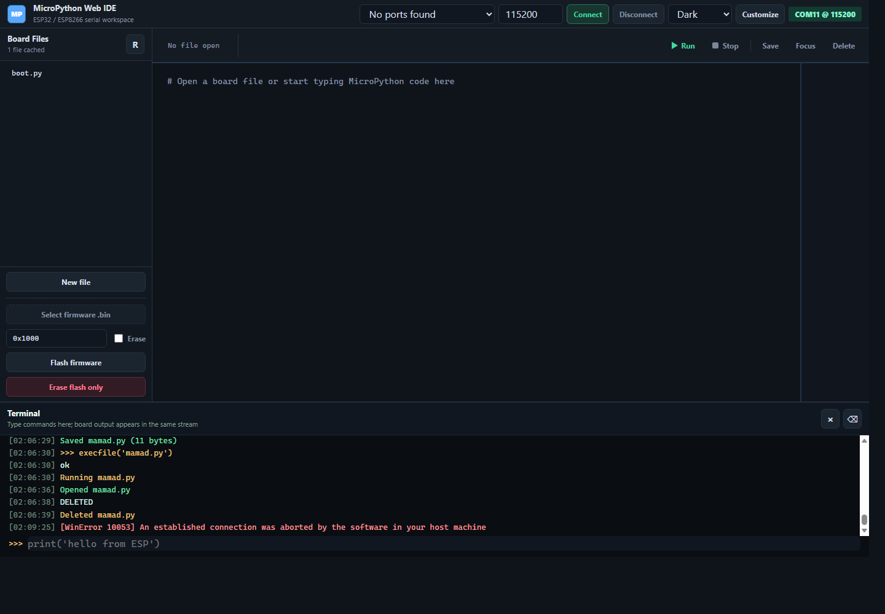
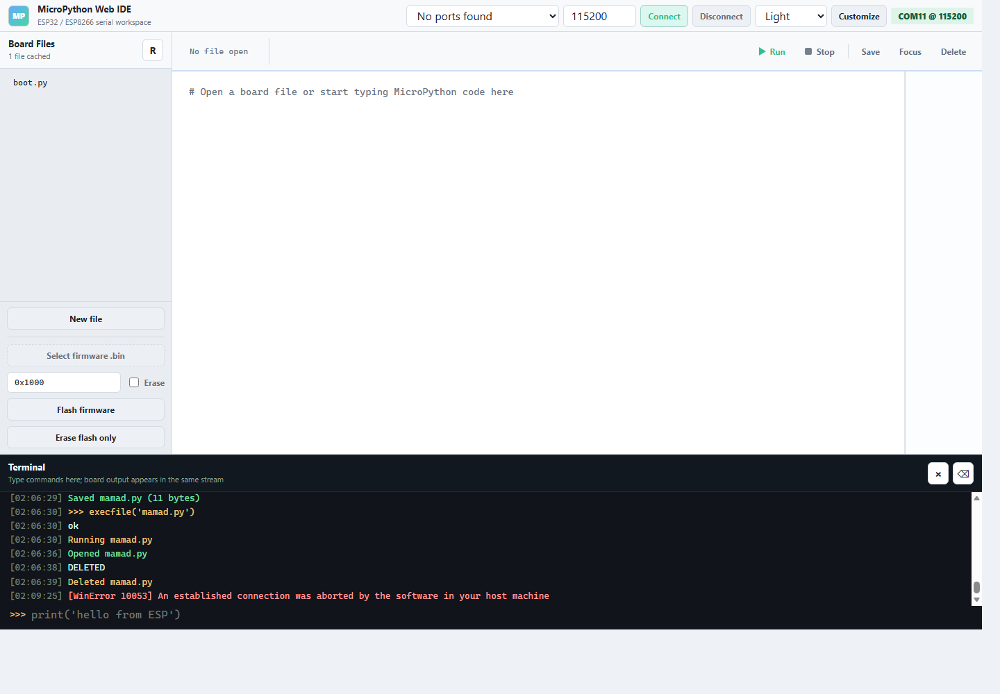
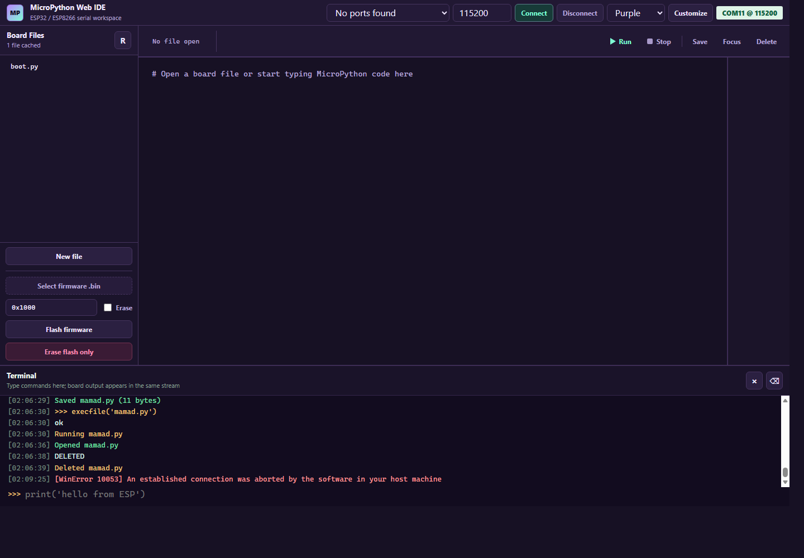
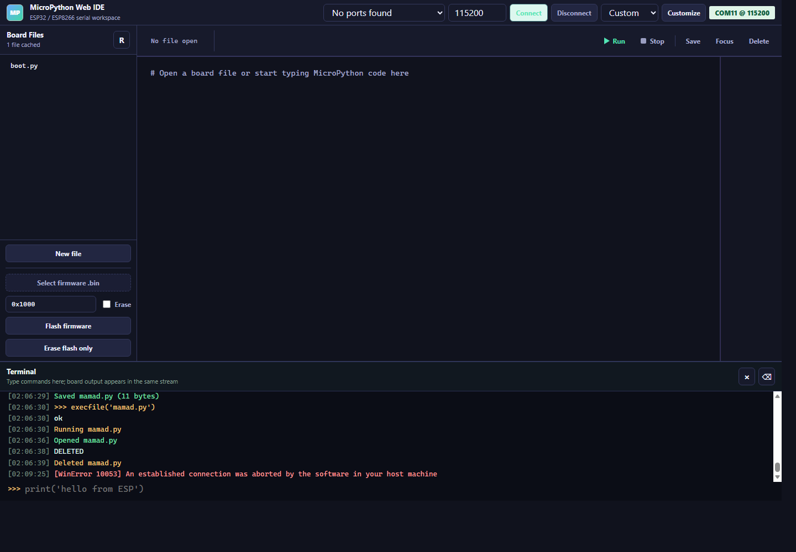

# MicroPyDesk

Local Web IDE for ESP32 / ESP8266 MicroPython.

MicroPyDesk runs on your computer, opens in your browser, and talks to your
board through the local USB serial port. Use it to edit files, save code to the
board, run MicroPython scripts, use a REPL/serial terminal, and flash firmware
without switching between multiple tools.


## Why MicroPyDesk

- Local-first: no cloud account, no remote server, no online workspace.
- Built for ESP32 and ESP8266 boards running MicroPython.
- One browser workspace for editing, running, terminal output, and firmware.
- Useful for quick experiments, classroom labs, workshops, and small embedded
  projects.
- Simple Python backend with static HTML, CSS, and JavaScript frontend.

## Theme Gallery

| Dark | Light |
| --- | --- |
|  |  |

| Purple | Custom |
| --- | --- |
|  |  |

## Features

- Browser-based MicroPython editor for ESP32 / ESP8266
- Automatic ESP serial port detection
- Board file browser
- Multiple open file tabs
- Save files directly to the microcontroller
- Auto-save changed files before running
- Run saved `.py` files from the UI
- Unified REPL and serial terminal
- Python syntax highlighting
- Editor helpers for brackets, quotes, indentation, `Tab`, `Shift+Tab`, and
  `Ctrl+Backspace`
- Dark, Light, Purple, and custom themes
- Firmware flashing with `.bin` files
- Full flash erase, with or without writing firmware
- Optional terminal CLI uploader

## Requirements

- Python 3.9+
- ESP32 or ESP8266 board
- USB data cable
- USB serial driver for your board, such as CP210x, CH340, CH341, or FTDI
- MicroPython firmware if you want to flash the board

Install dependencies:

```bash
pip install -r requirements.txt
```

Dependencies:

```txt
pyserial
esptool
adafruit-ampy
```

## Quick Start

Start the Web IDE:

```bash
python web_ide.py
```

On Windows, you can also run:

```bat
run_web.bat
```

On macOS or Linux:

```bash
sh scripts/run_web.sh
```

Open:

```txt
http://127.0.0.1:8765
```

If the browser keeps an old UI after updates, press `Ctrl + F5`.

## Typical Workflow

1. Connect your ESP32 or ESP8266 over USB.
2. Start MicroPyDesk.
3. Select the serial port, or use auto-detect.
4. Open a board file from the left sidebar, such as `main.py`.
5. Edit the file.
6. Press `Run`.

If the file has unsaved changes, MicroPyDesk saves it to the board first, then
runs it.

## Terminal

The terminal is unified:

- Type REPL commands directly in the terminal input line.
- Press `Enter` to send the command.
- Board serial output appears in the same terminal stream.
- Press `Ctrl + J` to show or hide the terminal.

## Firmware Flashing

Firmware controls are in the left sidebar.

To flash MicroPython firmware:

1. Click `Select firmware .bin`.
2. Choose your firmware file, for example `esp32.bin`.
3. Keep the flash address as `0x1000` unless your board or firmware requires a
   different address.
4. Optional: enable `Erase` to erase flash before writing firmware.
5. Click `Flash firmware`.

To erase the board without writing firmware:

1. Click `Erase flash only`.
2. Confirm the warning.

MicroPyDesk streams `esptool` output into the terminal in real time.

## Download MicroPython Firmware

Official MicroPython firmware downloads:

- ESP32: https://micropython.org/download/ESP32_GENERIC/
- ESP8266: https://micropython.org/download/ESP8266_GENERIC/

Use the `.bin` file that matches your board.

## CLI Uploader

The repository also includes a terminal-based uploader:

```bash
python uploader.py
```

Or use a runner:

```bat
run.bat
```

```bash
sh scripts/run_uploader.sh
```

The CLI supports file upload, firmware flashing, serial monitoring, REPL access,
and flash erase from a text menu.

## Project Structure

```txt
.
|-- web/
|   |-- index.html
|   |-- app.js
|   `-- styles.css
|-- docs/
|   |-- micropydesk-demo.gif
|   |-- web-ide-dark.png
|   |-- web-ide-light.png
|   |-- web-ide-purple.png
|   `-- web-ide-custom.png
|-- scripts/
|   |-- run_web.bat
|   |-- run_web.sh
|   |-- run_uploader.bat
|   `-- run_uploader.sh
|-- src/
|   |-- cli.py
|   |-- uploader/
|   `-- utils/
|-- web_ide.py
|-- uploader.py
|-- requirements.txt
|-- run_web.bat
`-- run.bat
```

## Troubleshooting

### Port is busy or access is denied

Close other serial monitors, IDEs, and terminal sessions that may be using the
same COM port. On Windows, only one program can usually hold the serial port at
a time.

### Files disappear after flashing

Flashing or erasing firmware can clear the board filesystem. If you had a file
open in a tab, press `Run` and MicroPyDesk will save that tab back to the board
before running it.

### Firmware flash fails

Check:

- The correct board port is selected.
- The `.bin` file matches your ESP board.
- The flash address is correct, usually `0x1000`.
- The USB cable supports data, not only charging.
- No other program is using the serial port.

### Browser shows old UI

Press:

```txt
Ctrl + F5
```

The app uses cache-busted asset URLs, but a hard refresh is still useful during
development.

## Notes

MicroPyDesk is a local tool. It runs an HTTP server on your machine and talks to
the microcontroller through the local serial port. It is not intended to be
exposed directly to the public internet.
